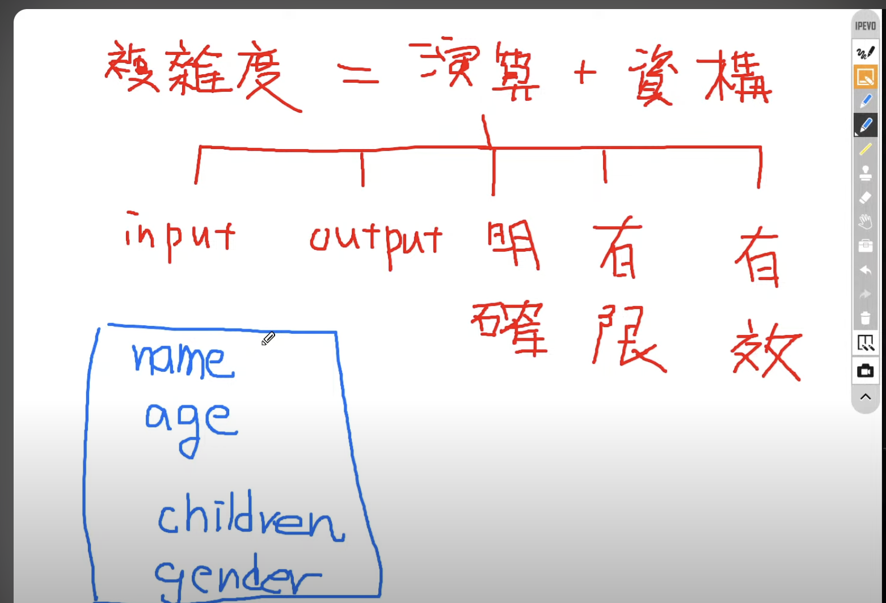
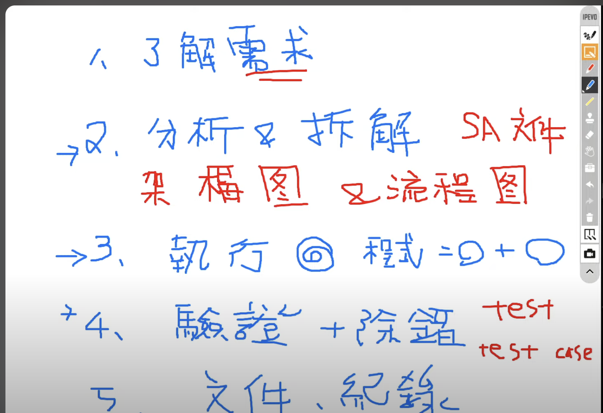

# [RD] 關於演算法、資料結構的小記錄

**Goal:**
提到演算法、資料結構，應該不外乎是想到 leetcode，我也是，因為 leetcode

1. 的演算法、資料結構，都偏向搜尋演算法，平常開發應該用不太到
    1. 用不太到是指，底層都做掉，以 JS 為例
        1. find、sort、etc… 是用這些演算法 implement 的
        2. Object、Array、etc… 是用這些資料結構 implement 的
2. 而大部分的演算法、資料結構在底層已經幫我們做好了
    1. 除了上述的 js 例子外，還有像是`其他語言的各種 implement` 、`sql` 、etc…也都是
3. etc…

昨天剛好在看到一部直播，就想寫這一篇 learning，

那部影片的 title 其實很大眾，不外是`淺談演算法、資料結構` 這樣的 Title(隨便查可以查到上千種資源的 title)

相較之前看得眾多文章、影片相比，我更喜歡這部，

讓我有一種真得吸收到腦袋裡的感覺，但也可能是之前無止盡的 input 後，剛好在這一部促進吸收，進而內化到長期記憶中(?)

下面把一些有感悟的部分，做一些圖文的心得

---

**Solution:**

要先有一個概念是，`**程式 = 演算法 + 資料結構` 。**

**`複雜度 = 演算法 + 資料結構` ，這個不知道是不是廣義的說法，但用來配合他的影片確實很容易理解**

眾所周知，複雜度其實還有分 時間複雜度 、 空間複雜度，因此以下大都是只**時間複雜度**～

---

這邊在還有一個概念是，**`先有資料結構，再提演算法`** 

因為我們寫程式都是在，`**有資料(某種已經排序好的資料結構)的情況下，去選擇我們要怎麼做(某種演算法)**`

---

那為什麼是`**已排序**` 的資料才有辦法使用演算法，

因為在未排序的情況下

1. 那肯定得從頭找到尾，若隨意跳過可能會直接Bye了
2. 最佳的 BigO 就是 O($n$)，沒辦法到 O($log n$) 甚至是 O(1)

什麼是 BigO ，請參考下面說明

---

1. 這邊以常見的 BigO 來看(這邊不特別解釋 n or log 是什麼，工程師應該會知道)
    1. 依我自己學的經歷來看，上網查絕對超過四種，重點是沒有體感也就是沒有概念
        1. 這裡舉例出四種
        2. 用一個很簡單的說詞來解釋，`BigO 就是次數`，而且是以`最差的結果`的情境下的次數
        
    2. 左邊紅字是排名(1是最好)、中間是資料本身、右邊是 BigO，
        1. O($n$)：最簡單粗暴，從頭找到尾。 有 n 個元素，最差就是找 n 次
        2. O($1$)：最優秀的，一次就找到。 有 n 個元素的數量，最差就是找 1 次
        3. O($n^2$)：四種裡面較差的，但還有更差的…。有 n 個元素，最差找 n * n 次
        4. O($log n$)：四種裡面的第二名。 有 n 個元素，最差就是找 0.5n 次，也就是一半的
        常見的且比較簡單的，`二分搜尋法`就是 O($log n$) 的例子
        
    3. **因此這裡有做一個小結論是**
        1. 寫出來的程式，`最低的底線就是 O($n$)`，不太應該有 O($n^2$) 或者以上的程式出現
            1. 不過仍是以資料結構為基礎，如果真的是一個需要跑雙迴圈或以上的結構，可能也逃不掉 O($n^2$)或以上的程式
            2. 那這樣該如何優化，就是要`轉換資料結構`，依照此資料結構，把它轉換成可以只跑 O($n$) 的資料結構
            3. 那要在前端轉還是後端轉，就是另外要討論的事情了
            4. 再接下來如何優化，依照 BigO 一步一步的優化，可以不用一次想優化到 O($log n$) or O($1$)，當然如果可以當然更好
            5. 另外 O($1$) 有點太理想，不太可能全都有辦法做到 O($1$)
        2. 如何判斷一段程式該如何優化，就是從 O($n^2$) → O($n$) → O($log n$) → O($1$) 的過程


簡單以四種 BigO 做舉例


左邊的 5、10、100 是數量，即上述的 n
右邊的就是最差可能要找幾次
簡單拿 O($n$) 和 O($log n$)，同樣是 100 個元素，
O($n$) 最差要找 100 次，
O($log n$) 最差要找 6~7 次，
這還是小數量，通常 n 越大(萬、千萬、億等級的數量)，那個差距會更明顯


常見的 BigO 折線圖，X軸是 n (數量)，Y軸是最差可能要找的次數

> P.S. 
像上述所說，演算法讓我覺得不外乎是指 leetcode，就很沒有實感，如果會當然很加分～～～

但在看完影片後，讓我有種，噢原來是這樣，

我平常寫程式的時候，就會特別去注意這部分，
優化程式時也會盡可能的，根據當前資料結構去處理程式，可能減少迴圈之類的
或者
去想更好的資料結構是否需要轉換，有沒有必要轉換

原來這就是開發過程中的演算法，因為我是沒感受到有特別指標，
單純只是想在 clean code 能看懂的範圍下，減少迴圈、降低找資料所需次數、etc…等，

但其實是無意識地以 BigO 的方式去優化，而不是越改越糟的優化
> 

---

1. 這邊就是剛剛提到的，以複雜度 = 演算法 + 資料結構來說明，
    1. 演算法
        1. 影片就簡單拿 function 做舉例，寫程式很常在寫 function，不管是轉資料 or etc…
        2. 接收一個 or 多個 input(s)，回傳明確、有限、有效的輸出
        3. function 裡面的 processing，就可以拿 BigO 判斷，這段程式如何，及如何繼續優化
        
        
        
    2. 資料結構（藍色的部分）
        1. 有一個 Person 這樣的結構
            
            ```tsx
            type Person = {
            	name: string;
            	age: number;
            	gender: 'male' | 'female';
            	children: Person[];
            }
            ```
            
            
            
        2. JS 不外乎就是 Array、Object，假如要找一個 person 的話，那要怎麼設計它
            1. 以下面為例就是 Array 包 Object，最差的情況下就會是
                1. 第一層 loop n 次
                2. 每一個元素又有 children(Person Array) 再一個ｎ次，以此類推的遞迴下去
                
                
                
                Array 包 Object
                
            2. 但不太可能這樣去找，所以還會有 Id( primary key) 之類的東西
            
            這又會牽扯到另外個議題了，先跳過(太難, 還在學習中但就同樣是資料結構，如：紅黑數、B+Tree 之類的＋各種搜尋演算法)
                
                
                
                每個 Person 加個 id 之類的

---

1. 演算法、資料結構，在軟體開發中的會在哪裡需要使用

左邊有箭頭的地方，就是演算法、資料結構需要被 defined or implement 的地方(2、3、4)
    
    
    
    簡單的 flow
    

---

> 有一些影片內容，因為沒有圖片，故而沒放到這裡，
但我其實是很想放得，因為真得很好理解，例如：用鋪克牌、衣櫃、出門作舉例
> 

---

**Refs:**

[https://www.youtube.com/watch?v=gi7JfN3qpao](https://www.youtube.com/watch?v=gi7JfN3qpao)