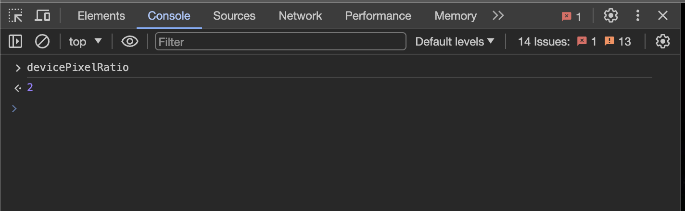
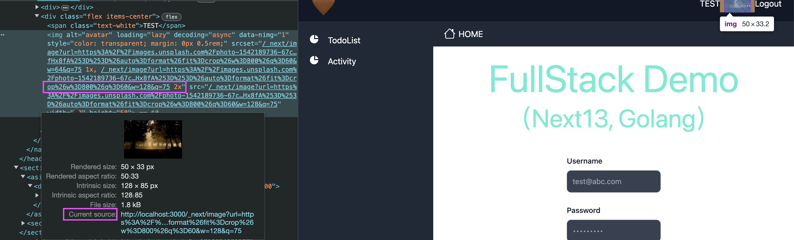
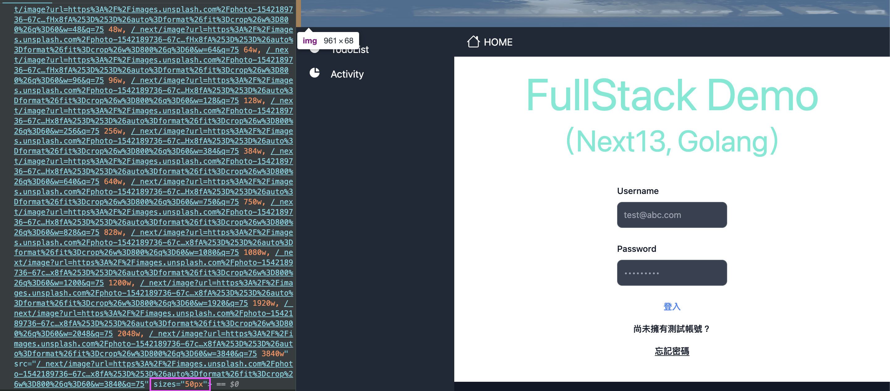

# Summary

最近在處理 image，把前端的圖片換成 next/image，為了優化前端效能。

最近在測試或者被問說，怎麼測試 or 圖片尺寸怎麼拿得太大或太小

```
Note:
next/image，有兩個影響尺寸的 required props，

{ width: number | string, height: number | string } | { fill:boolean }
兩個不能一起設定，只能擇一，

而設定不同的 props 也會有不同的結果：
1. width and height: next 會產生多個 srcset 但會以 `x` 為單位
2. fill: next 會產生多個 srcset 但會以 `w` 為單位
```

如果設定 fill props 沒有給 sizes，就會拿到圖片尺寸不如預期的狀況

```
P.S. 給 width and height 是最容易可以區分的

但使用 fill props，透過 srcset 的 w 為單位，讓 browser 根據 viewport 去拿圖片，
更能優化效能

另外，在一種情況下也要使用 fill props 才行：

就是在沒辦法寫死 width and height 的時候(e.g. 不同 media 時要有不同的尺寸)

會需要透過 parent element 設定 css 的 width and height(這樣可以設定不同的 css media)

最後記得在 parent element 上加上 relative，這樣 img 才會貼合 parent element 的長寬
(因為如果有給 fill props，next 會把 img 變成 absolute)
```

# 關於 srcset 中的 x 和 w 有什麼差別

### **一、如果 srcset urls 的單位設定為 x：**

這需要先知道自己的 device pixel ratio(裝置像素比)，提供一個方式可以看，當然也可以自己去查。
透過 devtool 來看，直接輸入 devicePixelRatio 就可以看到數值(截圖為 2）


<hr/>

範例一、自己 mac 的 devicePixelRatio 為 2 ，所以要拿 2x 的圖片


devicePixelRatio=2，所以會去拿 2x 得圖(128px).

```
P.S.
那如何知道當前 rendered 的圖片是哪一個？

1. 可以參考上方截圖的 `current source`
2. 對圖片右鍵 open new tab
3. Console Network 去看 request url
```

範例二、那如果現在 devicePixelRatio 是 1，要拿 1x 的圖片

若繼續參考上圖，因為 devicePixelRatio=1，所以會去拿 1x 得圖(64px).

<hr />

### 二、**如果 srcset urls 的單位設定為 w：**

設定為 w 的時候，就不用看 devicePixelRatio 了

因為瀏覽器會自己計算，但相對的要給 sizes，不然瀏覽器預設 sizes=100vw。

範例、

我目前 `sizes=50`，`DPR=2`，得到 50 \* 2 = 100。
**(Note: 這裡的 devicePixelRatio 的計算瀏覽器會自己算，「我們只要提供 sizes 就好」)**

所以瀏覽器會去拿 100px 的圖 (`如果找不到`，會找最接近但不小於 100px 的圖片，簡單來就是`往上找最接近的`)

因此，最後應該要拿 128w 的圖（因為100往上找最近的是128)



P.S. 那如果以上述的 100vw 來看怎麼辦？

以截圖來看，圖片的 100vw = 961px，devicePixelRatio=2，得到 961 \* 2 = 1922

因此，瀏覽器會去拿1922的圖，但因為沒有1922會往上找，所以最後圖片會去拿 2048w 的圖

### Refs:

1. Snapshot image source from [unsplash](https://unsplash.com/)
2. Project is my full stack side project

