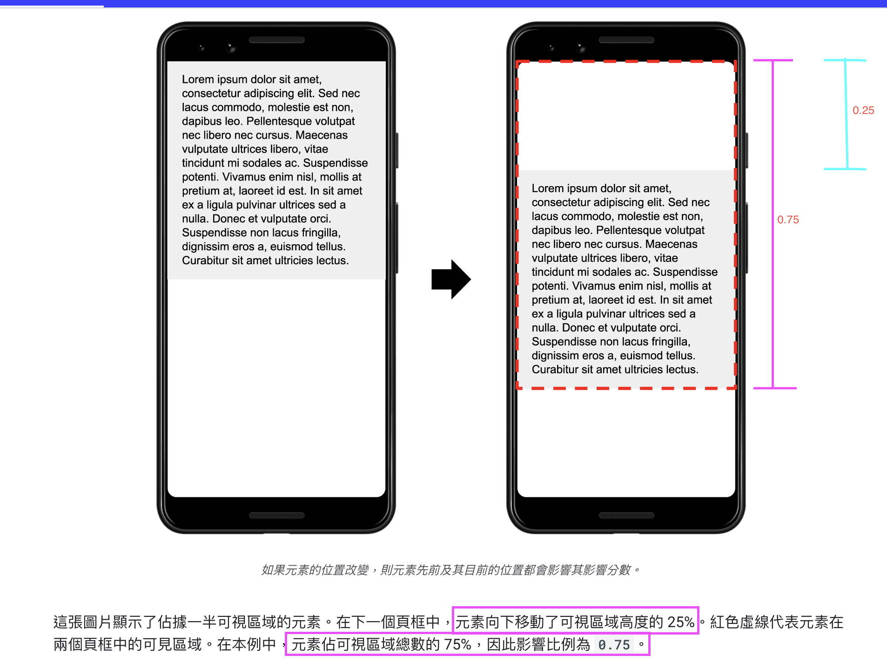

# CLS (Cumulative Layout Shift)

## 如何影響 user

使用者`第一眼看到的網頁`和`後幾眼看到的網頁`是否一樣

e.g. 
  1. 在閱讀文章時，突然被廣告擋住
  2. 想點擊登入按鈕，按鈕在下一秒就跑掉了
  3. 想點擊輸入框，輸入框在下一秒就跑掉了
  4. ...etc

諸如此類的都被納入 CLS 指標的一部分

## 計算方式

### 只有`可視區域`內中`不穩定的元素`會被納入計算範圍，且整個網頁的生命週期內都會測量 CLS，而非像其他指標可能只要計算網頁初始載入期間

> ###### <font color='orange'>標記是如何執行的?</font>
> 在 PerformanceObserver 裡，當下的 CLS element(不穩定元素) 會被標記成 entry of type is `layout-shift`
>
> 其中 entry 是一個 [PerformanceEntry](https://developer.mozilla.org/en-US/docs/Web/API/LayoutShift) 物件

> ###### <font color='orange'>什麼是穩定、不穩定元素?</font>
> 起始位置發生改變的元素，即不穩定元素，
>
> 反之，起始位置未發生改變的元素，即穩定元素


### 但並非所有元素的位移都會被納入計算，如：
1. 在 user input 後，500ms 內的元素位移，不會納入計算範圍，會被標記為 [hadRecentInput](https://wicg.github.io/layout-instability/#dom-layoutshift-hadrecentinput)，而會被排除計算

2. 因為動畫而產生的元素位移，也不會被納入計算範圍，但特別注意:
    * 這裡指得動畫是指，透過 `css transform` 或 `animation` 而產生的動畫
    * 如果是透過 top、right、bottom 或 left 屬性等產生的位移，一樣會被納入計算範圍噢

    > ###### <font color='orange'>為什麼動畫的計算標準，只針對 transform or animation?</font>
    > 這是因為，透過 transform or animation 只會造成 `repaint`
    >
    >
    > 但如果改變 top, right, bottom, left ，則會造成 `reflow`，
    > 
    > 進而導致 `layout 要重新計算`、`重新計算 dom nodes`，並且也會造成更多的效能問題
    >
    
    > P.S.
    >
    > Reflow 一定會觸發 repaint，但 repaint 不一定會觸發 reflow
    >
    > 會造成 reflow or repaint 的因素還有其他，因此在開發過程中可以時刻注意，`能 repaint 就不要 reflow`


### CLS 計算方式，可以總結成：
  `不穩定元素間位移後所佔「可視區域」面積的比率`(參考下圖右側紫色垂直線) 乘 `不穩定元素`的`位移量`(參考下圖右側亮藍色垂直線)
  ```text
    layout shift score = impact fraction * distance fraction
  ```

下圖，左圖為元素初始的位置、右圖為元素位移後的位置

因此下圖 CLS score 為 `0.75` * `0.25` = `0.1875`，

而 PR75 內 CLS score 要小於 `0.1s` 才會被視為 good score



## 如何改善

這裡的改善相對單純，透過一些工具(e.g. page speed、lighthouse)，

找到 CLS element，並改善它不要造成位移，進而不要影響其他元素位移


1. `保留/預設圖片的大小，預留圖片的空間`，等圖片 response 回來渲染時，而不造成位移
    - 設置 img 的 `width`、`height`
      ```plain
        
      ```
    - CSS 設定 `aspect-ratio` 直接設定圖片比例，也能達到同樣上述的效果，且有較好的 responsive 效果 
      - e.g. 以寬度為基準，透過 100% width 讓瀏覽器去計算圖片的高。
        ```plain
          img {
            width: 100%; /* or max-width: 100%; */
            height: auto;
            aspect-ratio: 16 / 9;
          }
        ```

    ---

2. 設置 `min-height` 給 CLS Element. (e.g. 廣告的版位)

    ---

3. `不要讓上方元素位移`，通常只要越上方的元素有位移，底下可視範圍的元素也很有可能被影響
    - `不要 lazyload 上方元素`
    - 上方`確定會渲染的元素`是 `CSR`，請確保給 min-height. 
      - 注意：如果該元素有可能不被渲染，會讓畫面上會有一個 min-height，進而導致 UI 不如預期，即使這並不會影響 performance
    ---

4. `Preconnect 字體`（如果是用非系統字體的話）
    - 透過 `CSS font-family` ，設定備用字體(通常會是系統字體)
      ```plain
        設定 sans-serif 作為 roboto 字體前
        font-family: "Roboto" , sans-serif;
      ```
    - 透過 `CSS font-display: swap`
      - 先顯示備用字體，等 font response 回來時再切換字體
    
    - 進階：透過 `size-adjust`、`ascent-override`、`descent-override` 和 `line-gap-override` 這些 API 來調整字型
      - 如果是用 nextjs 的 `@next/font`，預設已經會處理了
      - 如果要自行調整，可以等上述的調整完畢後，再來嘗試，歡迎參考[這裡](https://developer.chrome.com/blog/font-fallbacks)

    - P.S.
      - 字體的本身也是一門學問，關於字體有很多專有名詞. e.g. 行高、貼齊基準、大小、寬度
      - 如果有在玩過 canvas ，並在 canvas 畫布上寫字的話就會知道了，有時候文字會偏移都跟上述有相關. 有時候要微調，除了要理解上述的一些專有名詞還要算數學
      - 我也不是 canvas 大師，曾被折磨得很痛苦，真得是另一個領域的技術了，跟 webGL 一樣

## Refs

[web.dev](https://web.dev/articles/cls?hl=en)

[optimize CLS](https://web.dev/articles/optimize-cls)

[bfcachge](https://web.dev/articles/bfcache)
