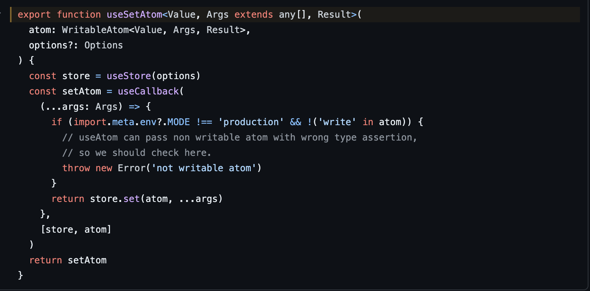
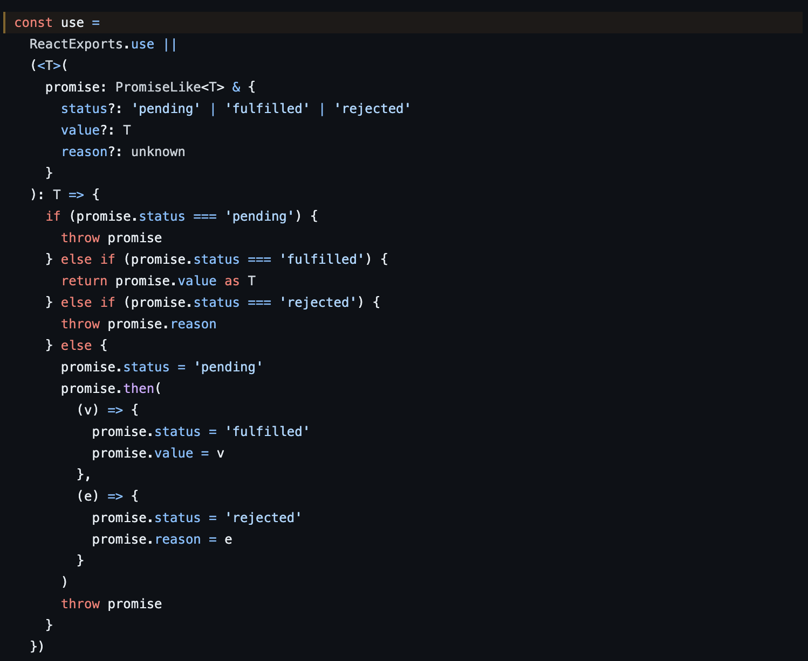

# Jotai

一個基於 hooks 方式，同時可以靈活組織多個 atom 來創建新的atom，並支持異步處理。

jotai 可以看作是 recoil 的簡化版本，都是採用分散管理原子狀態的設計模式，但是相較於recoil 更簡潔，不需要顯性使用selector。

1. Jotai 使用 context hook 作為最上層 provider，並使用 useRef 來儲存 store
    
    
    ](./assets/asset-1.png)
    
    [https://github.com/pmndrs/jotai/blob/main/src/react/Provider.ts#L18](https://github.com/pmndrs/jotai/blob/main/src/react/Provider.ts#L18)
    
2. Jotai 的 context store 會回傳三個東西(get、set、sub)，
透過這三個 function，維護建立 provider 時 createStore 回傳的 store 裡面的 weakMap、Set，
createStore 上面有很多 implement 可以學習
    
    ](./assets/asset-2.png)
    
    [https://github.com/pmndrs/jotai/blob/main/src/vanilla/store.ts#L785](https://github.com/pmndrs/jotai/blob/main/src/vanilla/store.ts#L785)
    
3. Jotai 用起來和 useState 很像，以及它是如何避免不必要的 rerender 的
    
    ```jsx
    主要使用方式可以參考官網文檔，簡單的使用方式如下：
    先建立一個 atom，參數可以是一個值也可以是其他東西，
    之後在傳入 useAtom 中使用
    
    const countAtom = atom(999)
    const [count, setCount] = useAtom(countAtom)
    ```
    
    ```jsx
    **atom function**: 會回傳一個帶有 key, init, read, write 四個 method 的 object，
    前兩個比較偏向 jotai 自己辨識用的。
    ```
    
    ](./assets/asset-3.png)
    
    [https://github.com/pmndrs/jotai/blob/main/src/vanilla/atom.ts#L83](https://github.com/pmndrs/jotai/blob/main/src/vanilla/atom.ts#L83)
    
    ---
    
    ```jsx
    
    **useAtom**: 回傳一個和使用 useState 時很像的 array
    [state, setState]
    
    在 jotai 裡同樣是 [state, setState] 但它是這樣回傳的
    [useAtomValue(atom, options), useSetAtom(atom, options)]
    ```
    
    ](./assets/asset-4.png)
    
    [https://github.com/pmndrs/jotai/blob/main/src/react/useAtom.ts#L38](https://github.com/pmndrs/jotai/blob/main/src/react/useAtom.ts#L38)
    
    ---
    
    ```jsx
    **useSetAtom：**這裡撇除掉 createStore 裡 private function implement
    
    這裡比較單純就是，它會回傳一個 set function，
    
    這個 function 其實就只是使用上面的 store.set (可以參考第二點 store)並把 atom 傳進去，然後 jotai 會處理很多 logic 去更新上面一開始 createStore 創建的 weakMap, etc...等，並回傳結果
    
    例如：getter、setter 會被傳進 atom.write，這是為什麼我們可以得到 get、set, etc...
    ```
    
    
    
    https://github.com/pmndrs/jotai/blob/main/src/react/useSetAtom.ts#L30
    
    ---
    
    ```jsx
    **useAtomValue**: 會回傳我們 atom 的值，而這裡會是控制 re-render 的關鍵，
    
    首先它有使用 use ，一個控制非同步的function，
    react 有實作，但 jotai 有實作類似的 polyfill
    https://github.com/pmndrs/jotai/blob/main/src/react/useAtomValue.ts#L13
    
    再來是它使用 useReducer 來處理 state，
    
    這裡的設計很酷
    jotai 是在使用 **useAtomValue** 取值時做 rerender 而不是在 set function
    
    它去判斷是否跟 store 裡的一樣，去做 rerender(其實就是 reducer 的 dispatch)，
    ```
    
    
    
    https://github.com/pmndrs/jotai/blob/main/src/react/useAtomValue.ts#L13
    
    ---
    
    ](./assets/asset-7.png)
    
    [https://github.com/pmndrs/jotai/blob/main/src/react/useAtomValue.ts#L59](https://github.com/pmndrs/jotai/blob/main/src/react/useAtomValue.ts#L59)
    

---

總結：
首先 store 會被傳進 provider value 中，

set function 會去更新 store 的值，但因為它是被存在 useRef 中，所以它不會造成 rerender，

而在 useAtomValue 取值時，會去檢查目前的值和 store 中的值是否一樣，判斷是否需要 rerender，

所以它的 rerender 只會發生在，當前有使用 useAtomValue ****的 component