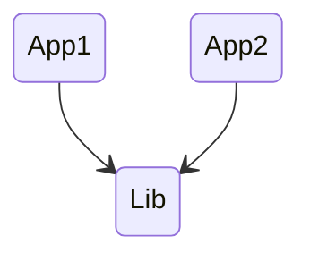

# Mental Model

Powerful core, `driven by metadata`, and extensible through `plugins`.

The mental model around how Nx works with `project graphs`,
`task graphs`, `affected commands`, `computation hashing and caching`.

## 1. The project graph

Projects are identified by the presence of a `package.json` file or `project.json` file

## 2. The task graph

Nx uses the project graph to create a task graph.

Any time you run anything, Nx creates a task graph from the project graph and then executes the tasks in that graph.

## 3. Affected commands

- Nx to do the same for two tasks `app1:test` and `lib:test`.

```sh
nx run-many -t test -p app1 lib
```

- Nx to do this for `all the projects`.

```sh
nx run-many -t test
```

- Nx looks at the files you changed in your PR.

  For example:
  If my PR changes the lib and I then run `nx affected -t test`,
  Nx figures out that `App1` and `App2` depend on lib,
  so it will invoke `nx run-many -t test -p App1 App2 Lib` lib to test App1 and App2 as well.

```sh
nx affected -t test
```



## 4. Nx Cloud

- Run any task graph on many agents instead of locally.

- **Run the build locally (which can take hours for large workspaces)**.
  We will `send the Task Graph to Nx Cloud`.
  Nx Cloud Agents will then `pick up the tasks they can run and execute them at remote`.

- As agents complete tasks,
  the main job where you invoked nx affected --build will start receiving created files and terminal outputs.

  After nx affected --build completes, the machine will have the build files and all the terminal outputs as if it ran it locally.
