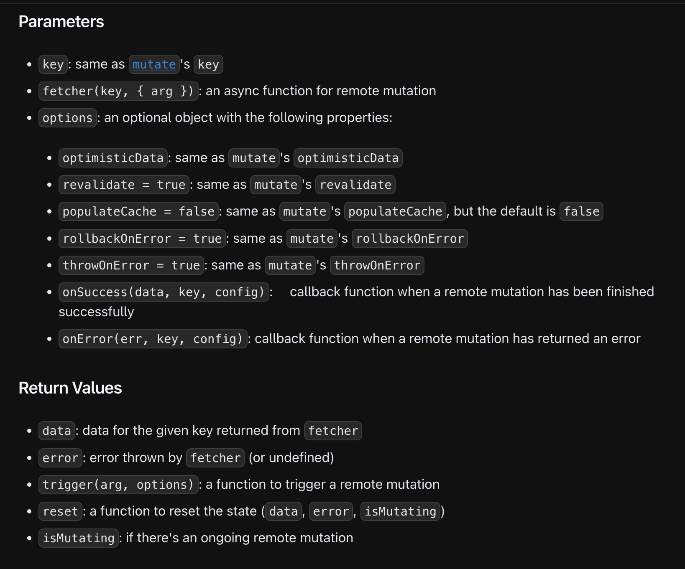

# Mutate Data Manually

### **主題：**Type Signature(useSWRMutation)



---

### **主題：Defined a hook for remote mutations**

```tsx
/*
	The remote mutations depend on useSWRMutation hook, 

	The remote mutations are only triggered manually, 
	instead of automatically like useSWR.
*/

import useSWRMutation from 'swr/mutation'
 
// The extra argument will be passed the `arg` property of the 2nd parameter.
// In the example below, `arg` will be `'my_token'`
async function updateUser(url, { arg }: { arg: string }) {
  await fetch(url, {
    method: 'POST',
    headers: {
      Authorization: `Bearer ${arg}`
    }
  })
}

function Profile() {
  // A useSWR + mutate like API,but it will not start the request automatically.
  const { trigger } = useSWRMutation('/api/user', updateUser, options)

	const handleUpdate = () => {
		// Trigger `updateUser` with a specific argument.
    trigger('my_token')
	}
 
  return <button onClick={handleUpdate}>Update User</button>
}
```

---

### **主題：Usage For Update**

範例一、Basic Usage

```tsx
import useSWRMutation from 'swr/mutation'
 
async function sendRequest(url, { arg }: { arg: { username: string }}) {
  return fetch(url, {
    method: 'POST',
    body: JSON.stringify(arg)
  }).then(res => res.json())
}
 
function App() {
  const { trigger, isMutating } = useSWRMutation('/api/user', sendRequest, /* options */)
 
  return (
    <button
      disabled={isMutating}
      onClick={async () => {
        try {
          const result = await trigger({ username: 'johndoe' }, /* options */)
        } catch (e) {
          // error handling
        }
      }}
    >
      Create User
    </button>
  )
}
```

範例二、Use mutation result to render UI with data return value.

```tsx
const { trigger, data, error } = useSWRMutation('/api/user', sendRequest)
```

範例三、Optimistic Updates

1. Mutation could detect the cache store to avoid race conditions between useSWR.
2. Update the local data immediately, send a request to update the data under the background.
3. With `rollbackOnError` option to sure the data is update correct in the database.

```tsx
/*
	The optimisticData option defined in useSWRMutation	
	
	Trriger function will be passed the parameter to updateUser 

	but the SWR will update by optimisticData.
*/
const { trigger } = useSWRMutation('/api/user', updateUser, {
  optimisticData: current => ({ ...current, name: newName })
})

// or

/* 
	The optimisticData defined in trigger function

	In my opinion, this way is usage way.
*/
 
trigger(newName, {
  optimisticData: current => ({ ...current, name: newName })
})

```

範例三、

---

### **主題：Usage For Fetch**

範例ㄧ、Defer loading data until needed

```tsx
/*
	Defer fetch data until the trigger called.
*/
import { useState } from 'react'
import useSWRMutation from 'swr/mutation'
 
const fetcher = url => fetch(url).then(res => res.json())
 
const Page = () => {
  const [show, setShow] = useState(false)
  // Data is undefined until trigger is called
  const { data: user, trigger } = useSWRMutation('/api/user', fetcher);
	
	const handleClick = () => {
      trigger();
      setShow(true);
	} 
 
  return (
    <div>
      <button onClick={handleClick}>Show User</button>

      {show && user ? <div>{user.name}</div> : null}
    </div>
  );
}
```