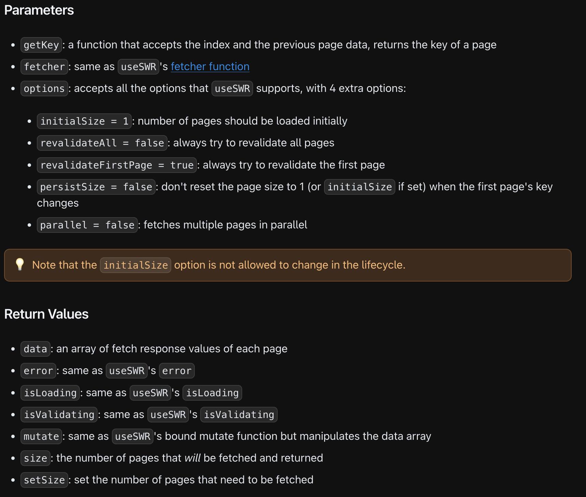

# Pagination

### **主題：**Basic Usage

```tsx
// The key will contain page index
function App () {
  const [pageIndex, setPageIndex] = useState(0);
 
  // The API URL includes the page index, which is a React state.
  const { data } = useSWR(`/api/data?page=${pageIndex}`, fetcher);
 
  // ... handle loading and error states
 
  return <div>
    {data.map(item => <div key={item.id}>{item.name}</div>)}
    <button onClick={() => setPageIndex(pageIndex - 1)}>Previous</button>
    <button onClick={() => setPageIndex(pageIndex + 1)}>Next</button>
  </div>
}
```

範例二、Abstraction the page component also use by SWR cache to preload next page data

```tsx
function Page ({ index }) {
  const { data } = useSWR(`/api/data?page=${index}`, fetcher);
 
  // ... handle loading and error states
 
  return data.map(item => <div key={item.id}>{item.name}</div>)
}
 
function App () {
  const [pageIndex, setPageIndex] = useState(0);
 
  return <div>
		/* Basic load page data*/
    <Page index={pageIndex}/>

		/* 
			Load next page data in the hidden div but the data
			will set to cache when the above Page component load next
			will hit the cache data.
		*/
		<div style={{ display: 'none' }}><Page index={pageIndex + 1}/></div>

    <button onClick={() => setPageIndex(pageIndex - 1)}>Previous</button>
    <button onClick={() => setPageIndex(pageIndex + 1)}>Next</button>
  </div>
}
```

---

### **主題：Infinite Loading**

The Type Signature



```tsx
/*
	as same as useSWR but returns 2 extra value,

	size as page index, 

	setSize as page setter.
*/
import useSWRInfinite from 'swr/infinite'

const { data, error, isLoading, isValidating, mutate, size, setSize } = useSWRInfinite(
  getKey, fetcher?, options?
)
```

範例ㄧ、The Index Based Paginated API

```tsx
/*
	GET /users?page=0&limit=10
	[
	  { name: 'Alice', ... },
	  { name: 'Bob', ... },
	  { name: 'Cathy', ... },
	  ...
	]
*/

const getKey = (pageIndex, previousPageData) => {
	// reached the end
  if (previousPageData && !previousPageData.length) return null 
	
	// returns SWR key
  return `/users?page=${pageIndex}&limit=10`                    
}

function App () {
  const { data, size, setSize } = useSWRInfinite(getKey, fetcher)
  if (!data) return 'loading'
 
  // We can now calculate the number of all users
  let totalUsers = 0
  for (let i = 0; i < data.length; i++) {
    totalUsers += data[i].length
  }
 
  return <div>
    <p>{totalUsers} users listed</p>
    {data.map((users, index) => {
      // `data` is an array of each page's API response.
      return users.map(user => <div key={user.id}>{user.name}</div>)
    })}
    <button onClick={() => setSize(size + 1)}>Load More</button>
  </div>
}
```

範例二、Cursor or Offset Based Paginated API

```tsx
/*
	GET /users?cursor=123&limit=10
	{
	  data: [
	    { name: 'Alice' },
	    { name: 'Bob' },
	    { name: 'Cathy' },
	    ...
	  ],
	  nextCursor: 456
	}
*/

const getKey = (pageIndex, previousPageData) => {
  // reached the end
  if (previousPageData && !previousPageData.data) return null
 
  // first page, we don't have `previousPageData`
  if (pageIndex === 0) return `/users?limit=10`
 
  // add the cursor to the API endpoint
  return `/users?cursor=${previousPageData.nextCursor}&limit=10`
}
```

---

### **主題：Parallel Fetching**

```tsx
/*
	The default data fetching is in sequence.

	Set the parallel option to true, could change default behavior.
*/

/*
	parallel = false (default as sqeuence)
	
	page1 ===> page2 ===> page3 ===> done
*/

/*
	parallel = true
	
	page1 ==> done
	page2 =====> done
	page3 ===> done
*/

// If parallel fetching that previousPageData is always `null`
const getKey = (pageIndex, previousPageData) => {
  return `/users?page=${pageIndex}&limit=10`
}
 
function App () {
  const { data } = useSWRInfinite(getKey, fetcher, { parallel: true })
}
```