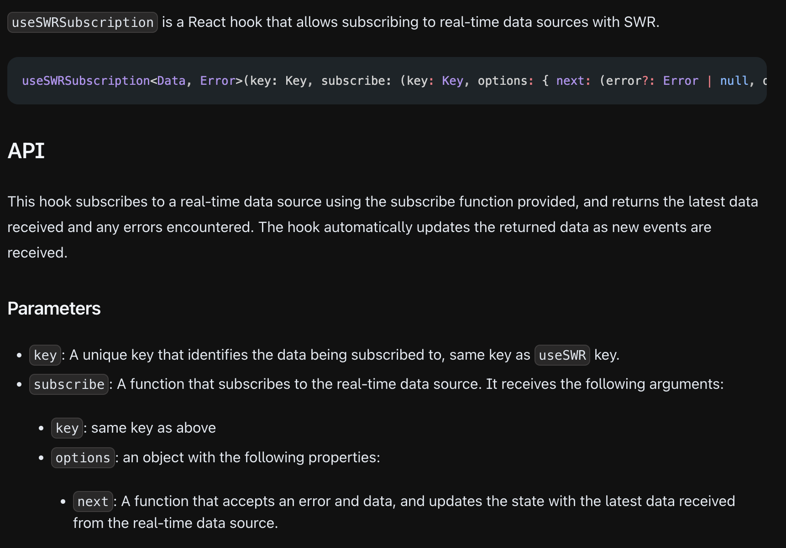

# Subscription

### **主題：**Type Signature

```tsx
useSWRSubscription<Data, Error>(
	key: Key, 
	subscribe: (
		key: Key, 
		options: { next: (error?: Error | null, data: Data) => void }
	) => () => void
): { data?: Data, error?: Error }
```



---

### **主題：**Basic Usage

```tsx
/*
	
*/
import useSWRSubscription from 'swr/subscription'
 
function Post({ id }) {
	// The first parameter is key
	// The second parameter is callback received the key same as first parameter
	// The options.next could update real-time data and return cleanup function.
  const { data } = useSWRSubscription(['views', id], (key, { next }) => {
		// This key is same as first parameter.
		const [_, postId] = key
	
    const ref = firebase.database().ref('views/' + postId)
		
		// Real-time update the SWR error and data
		// next(this parameter is error, this parameter is data)
    ref.on('value',
      snapshot => next(null, snapshot.data()),
      err => next(err)
    )

		// returns a cleanup function.
    return () => ref.off()
  })
 
  return <span>Your post has {data} views!</span>
}
```